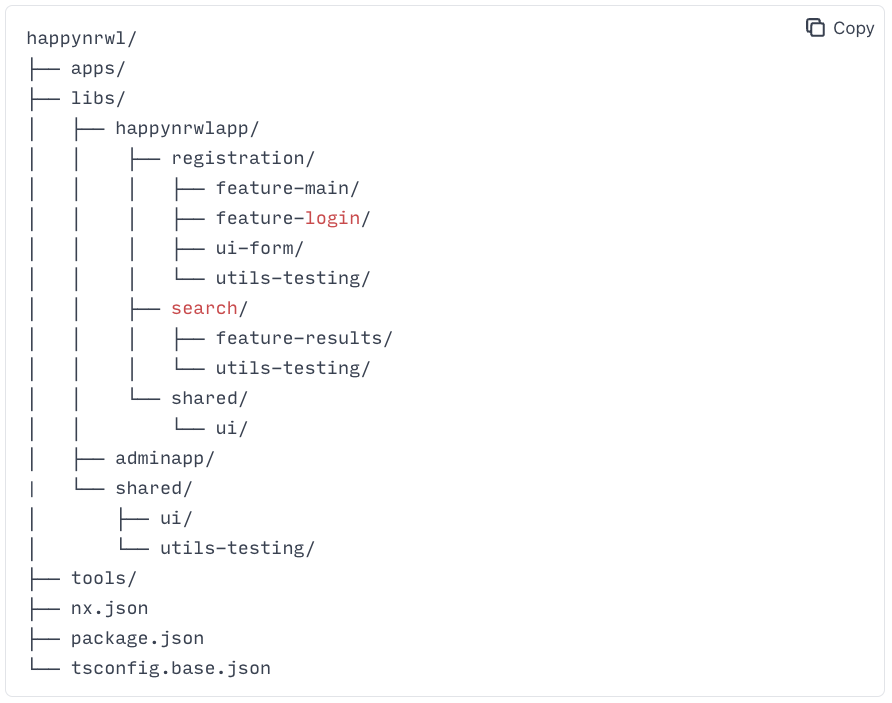

# Frontend

## Scope

- API Product
  - Website
    - APP Name: mobile
  - CMS
    - APP Name: admin

## Development

### Install Packages Management Tool

[pnpm](https://pnpm.io/zh-TW/installation)

### Install Packages

```shell
pnpm install
```

### Install Build System

[nx](https://nx.app/)

```shell
pnpm add -g nx
```

### Development

#### HMR

```shell
# Run App
# nx serve [APP Name]

# Run mobile app
nx serve mobile

# Run admin app
nx serve admin
```

#### Storybook

```shell
# Generating Storybook Configuration
nx g @nrwl/react:storybook-configuration [project-name]

# Storybook
# nx storybook [APP Name]

# Storybook mobile app
nx storybook mobile

# Storybook admin app
nx storybook admin

# Storybook lib: shared-ui
nx storybook mobile-shared-ui
```

#### Lint

```shell
# Lint
# nx lint [APP Name]

# Lint mobile app
nx lint mobile

# Lint admin app
nx lint admin
```

#### Format

```shell
# Format
# nx format
nx format:check
nx format:write
# nx format [APP Name]

# Format mobile app
nx format:check mobile
nx format:write mobile

# Format admin app
nx format:check admin
nx format:write admin
```

### Show Dependencies

```shell
# Graph Apps
nx graph

```

### Build

```shell
# Build App
# nx build [APP Name]

# Build mobile app
nx build mobile

# Build admin app
nx build admin
```


## Projects Command

### Base
```shell
nvm use 16.16.0
node -v
rm -rf node_modules
npm uninstall nx --location=global
npm install nx --location=global
pnpm install
npm -v
nx reset
```

### Mobile
```shell
pnpm nx build mobile
pnpm nx serve mobile
```

### Admin (old)
```shell
cd ./packages/dlh-web
npm install
npm run [scripts]
```


## Recipe

- Git
  - [Commit Message Guidelines](https://gist.github.com/brianclements/841ea7bffdb01346392c)
- Nx
  - [Mental Model](https://nx.dev/concepts/mental-model)
  - Core Features
  - Plugin Features
  - Conceipts
    - [Monorepos](https://nx.dev/more-concepts/why-monorepos)
    - _[Applications and libraries](https://nx.dev/more-concepts/applications-and-libraries)_
    - [Publishable and Buildable Nx Libraries](https://nx.dev/more-concepts/buildable-and-publishable-libraries)
    - Library
      - [Creating Libraries](https://nx.dev/more-concepts/creating-libraries)
      - [Library Types](https://nx.dev/more-concepts/library-types)
      - [Grouping Libraries](https://nx.dev/more-concepts/grouping-libraries)
    - [Using Nx at Enterprises](https://nx.dev/more-concepts/monorepo-nx-enterprise#code-organization-&-naming-conventions)
    - [Tag in Multiple Dimensions](https://nx.dev/recipe/tag-multiple-dimensions)
    - [Enforce Project Boundaries](https://nx.dev/core-features/enforce-project-boundaries)

## Best Practices



- importants
  - mental model
    - application
      - as containers, link, bundld and compile implemented in libraries
      - place 80% of your logic intor the libs/folder
      - and 20% into apps
    - libraries
  - library Types
    - feature
    - ui
    - data-access
    - utility
    - share

```shell
# --dry-run
nx g @nrwl/workspace:library feature-bank --dry-run --directory=account/mobile --tags=scope:mobile,type:feature

# directory: mobile/account/feature-bank , library-type: feature, name: feature-bank, tags: scope:mobile, type:feature
nx g @nrwl/workspace:library feature-bank --directory=account/mobile --tags=scope:mobile,type:feature

# directory: mobile/shared/ui , library-type: ui, name: ui tags: scope:mobile, type:ui
# dry run
nx g @nrwl/react:library ui --dry-run --directory=mobile/shared --tags=scope:mobile,type:ui
# run
nx g @nrwl/react:library ui --directory=mobile/shared --tags=scope:mobile,type:ui

# next.js add page
nx g @nrwl/next:page demo --project=admin

# next.js add component 
nx g @nrwl/next:component protable --project=admin

```

[Using pnpm with Lerna
](https://lerna.js.org/docs/recipes/using-pnpm-with-lerna)

## pnpm workspace (未使用)
```shell

# use pnpm workspace to manage packages
#Run pnpm import to generate a pnpm-lock.yaml file
pnpm import # root path cannot have pnpm-lock.yaml, otherwise cannot generate packages's pnpm-lock.yaml
# install packages's dependecies in workspace
pnpm install 

```

## Lerna (未使用)
```shell
# install lerna
# pnpx learn init # 無效
pnpx lerna init

# Bootstrapping Projects
pnpx lerna bootstrap --use-workspaces

```

## nx + lerna (未使用)
* [Integrating Nx and Lerna](https://nx.dev/recipe/lerna-and-nx)
```shell
# install nx + pnpm workspace's packages
pnpm install

pnpm nx run build

#pnpx lerna run build --scope=dlh-web 
#pnpx lerna run build --scope=backstage_system

# install package 
pnpm -F  backstage_system  add webpack-dev-server@3.11.0 -D 
```


## issues
* [next-plugin-antd-less](https://www.npmjs.com/package/next-plugin-antd-less)
* Module not found: Can't resolve 'null-loader'
  * [null-loader](https://www.npmjs.com/package/null-loader)
* [Cannot use import statement outside a module](https://stackoverflow.com/questions/66244968/cannot-use-import-statement-outside-a-module-error-when-importing-react-hook-m)
* [next-transpile-modules](https://www.npmjs.com/package/next-transpile-modules)
* [style is broken on build but works on dev env](https://github.com/SolidZORO/next-plugin-antd-less/issues/103)
* [ReferenceError: document is not defined in Next.js while working with React Aria overlays](https://stackoverflow.com/questions/64614006/referenceerror-document-is-not-defined-in-next-js-while-working-with-react-aria)
* [React 18: Hydration failed because the initial UI does not match what was rendered on the server](https://stackoverflow.com/questions/71706064/react-18-hydration-failed-because-the-initial-ui-does-not-match-what-was-render)
* [Solve “document is not defined” errors in Next.js](https://www.webtutpro.com/solve-document-is-not-defined-errors-in-next-js-26fea778b868)
* [Though the "loose" option was set to "false" in your @babel/preset-env config, it will not be used for @babel/plugin-proposal-private-methods since the "loose" mode option was set to "true" for @babel/plugin-proposal-class-properties](https://github.com/rails/webpacker/issues/3008)
* [NX Passed 11161 file paths to Git to hash, but received 11148 hashes. #9946](https://github.com/nrwl/nx/issues/9946)
## TODO
* [搬移 git commit 紀錄到新的 git repo 上](https://medium.com/@pgtsai/搬移-git-commit-紀錄到新的-git-repo-上-13a6c84cb354)
